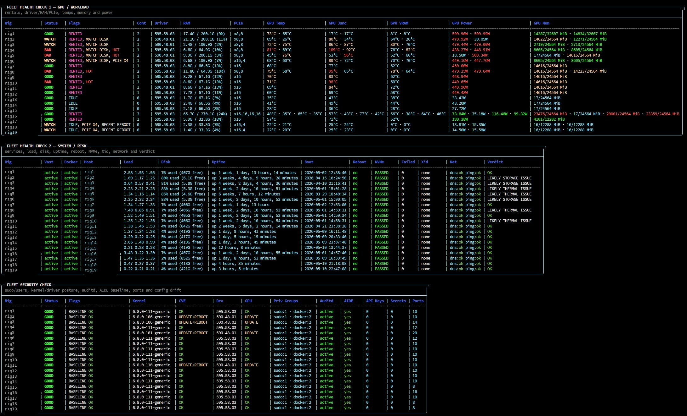

# Fleet Health Check

Read-only SSH-based fleet dashboard for GPU servers, Docker hosts, and Vast.ai rigs.

It gives you one terminal view for:

- GPU workload and rental state
- temperatures, memory, power, PCIe, and NVMe health
- Docker / Vast / systemd service health
- reboot, disk, load, network, and time-sync risk
- security drift: sudo users, SSH keys, auditd, AIDE, cron, sudoers, and persistence paths

Optional Telegram alert modes can watch the fleet continuously and message you when something actually changes: rentals starting/stopping, rigs going bad, GPU temperature problems, disk/network/reboot risks, or security drift. Alerts use stability checks and hysteresis so one bad SSH/API sample does not spam you.



## What it does

Fleet Health Check connects from your controller machine to each rig over SSH, runs a read-only collector, and renders the result locally.

The default dashboard is split into three sections:

1. **GPU / Workload**
   - shows whether rigs are idle/rented
   - GPU count, driver, RAM, PCIe width
   - GPU core temp, junction temp, VRAM temp
   - GPU memory and power draw

2. **System / Risk**
   - Docker and Vast service state
   - running container count
   - load, disk, uptime, boot time
   - reboot-required state
   - NVMe health
   - failed systemd services
   - Xid GPU errors
   - DNS/ping status
   - plain verdict like `OK`, `LIKELY THERMAL ISSUE`, or `LIKELY STORAGE ISSUE`

3. **Security Check**
   - root-equivalent users
   - sudo/docker/wheel group counts
   - auditd status
   - AIDE database status
   - SSH key drift
   - sudoers drift
   - cron/systemd/persistence drift
   - kernel/driver posture

The controller-side check is intended to be read-only. The optional installers modify target rigs only to install prerequisites or security monitoring tools.

## Quick start

### 1. Clone

```bash
git clone https://github.com/ftwlien/Fleet-Health-Check-public.git
cd Fleet-Health-Check-public
```

### 2. Configure your rigs

Edit the `RIGS` block in `fleet_health_check.py`:

```python
RIGS = [
    ("rig1", "user@192.0.2.10"),
    ("rig2", "user@192.0.2.11"),
]
```

Format:

```python
("label-shown-in-dashboard", "ssh_user@ip_or_hostname")
```

Test SSH first:

```bash
ssh user@192.0.2.10 hostname
```

If SSH does not work manually, Fleet Health Check cannot collect from that rig.

### 3. Install target prerequisites on each rig

Normal health prerequisites:

```bash
bash install-fleet-health-prereqs.sh
```

Optional security monitoring stack:

```bash
sudo bash install_fleet_security_stack.sh
```

After the normal installer, reconnect SSH so Docker group membership applies.

## About a full “install everything” command

It is possible to wrap the setup into one convenience installer that runs both target-side installers:

```bash
bash install-fleet-health-prereqs.sh
sudo bash install_fleet_security_stack.sh
```

That kind of command is useful for fresh rigs because it can install:

- health prerequisites
- `gputemps`
- SMART/NVMe checks
- auditd
- AIDE
- audit rules
- `fleet-security-check`

However, **saving the security baseline should not be fully automatic by default**.

The baseline is the trusted snapshot. If a host is already misconfigured or compromised and you blindly save it, you mark that bad state as trusted.

Recommended safe workflow:

```bash
python3 fleet_health_check.py --security
```

Review the security view. If the fleet looks clean and the changes are expected, then save the trusted baseline:

```bash
python3 fleet_health_check.py --security-baseline save
```

In other words:

- automate installing tools on the rigs
- verify the result from the controller
- save the baseline only after you agree the current state is trusted

## Main commands

Default dashboard:

```bash
python3 fleet_health_check.py
```

Live dashboard, checks every 5 seconds and redraws only when output changes:

```bash
python3 fleet_health_check.py --watch-v2 5
```

`--watch-v2` prints a loading line immediately, then draws the first dashboard after the initial SSH collection finishes. This avoids a blank terminal during the first fleet poll.

Security-only view:

```bash
python3 fleet_health_check.py --security
```

Important flags only:

```bash
python3 fleet_health_check.py --flags
```

One rig per block:

```bash
python3 fleet_health_check.py --vertical
```

Machine-readable JSON:

```bash
python3 fleet_health_check.py --json
```

Anonymized labels:

```bash
python3 fleet_health_check.py --public-labels
```

## Telegram alerts

Fleet Health Check has three Telegram modes.

### Everything bot

Use this for normal 24/7 monitoring:

```bash
python3 fleet_health_check.py --telegram-bot 60
```

This runs both alert systems every 60 seconds:

- health/rental alerts
- security alerts

### Health/rental only

```bash
python3 fleet_health_check.py --telegram-watch 60
```

Sends alerts for:

- rental started / ended
- hot GPUs
- Vast down
- Docker down
- NVMe warnings
- Xid GPU errors
- failed services
- network/DNS/ping warnings
- clock/NTP unsynced
- PCIe x4
- disk watch / low disk

### Security only

```bash
python3 fleet_health_check.py --security-telegram-watch 60
```

Sends alerts for:

- root-equivalent user changes
- sudo/wheel/docker group changes
- SSH key changes
- sudoers changes
- auditd/AIDE/helper drift
- cron/systemd/persistence drift
- kernel/driver posture changes

### Telegram configuration

Set credentials with environment variables or a local `.env` file:

```bash
TELEGRAM_BOT_TOKEN=your_bot_token
TELEGRAM_CHAT_ID=your_chat_id
```

`.env`, alert state, and other runtime files are ignored by git.

### False-positive protection

Noisy checks are intentionally conservative.

Examples:

- Network warning needs repeated failed checks before alerting.
- Clock/NTP warning needs repeated failed checks before alerting.
- Health flags need repeated confirmation before alerting/clearing.
- Temperature alerts need confirmed hot samples and clear hysteresis.
- Security changes need repeated identical scans before alerting.
- Startup seeds current state silently instead of spamming existing issues.

This is meant to avoid one bad SSH/ping/API sample causing a scary false alert.

## Normal health installer

Run on each target rig:

```bash
bash install-fleet-health-prereqs.sh
```

What it does:

- installs `smartmontools`
- installs build dependencies for `gputemps`
- builds and installs `/usr/local/bin/gputemps`
- allows passwordless `smartctl` for drive health checks
- allows passwordless `gputemps` for GPU junction/VRAM temp checks
- adds the target user to the `docker` group
- fixes a common Vast metrics helper permission issue if present
- clears stale failed systemd units

Quick target-side checks:

```bash
docker ps
sudo -n smartctl -H /dev/nvme0n1
sudo -n /usr/local/bin/gputemps --json --once
systemctl --failed
```

## Security stack installer

Run on each target rig if you want security drift monitoring:

```bash
sudo bash install_fleet_security_stack.sh
```

This installs and configures:

- `auditd`
- `aide`
- audit rules
- AIDE baseline database
- `/usr/local/bin/fleet-security-check`

Quick target-side checks:

```bash
systemctl is-active auditd
sudo /usr/local/bin/fleet-security-check
ls -lh /var/lib/aide/aide.db*
```

## Security stack explained

The security part is not an antivirus and not a full SIEM. It is a practical drift detector for GPU/Vast hosts.

It answers:

- Did a new sudo user appear?
- Did a root-equivalent UID 0 account appear?
- Did SSH authorized keys change?
- Did sudoers or sudoers.d change?
- Did cron/systemd persistence files change?
- Is auditd still active?
- Is the AIDE database present?
- Did kernel/driver posture change?
- Did a host-side API key, token, or private key get saved in shell history or env files?

The point is simple: if someone gets access and tries to make that access persistent, you want it to stand out immediately. A common path is adding a new sudo-capable user, adding an SSH key, changing sudoers, dropping a systemd service, adding cron persistence, or leaving sensitive tokens on disk. Fleet Health Check keeps a baseline of the trusted state and flags those changes so you can quickly see that something is wrong.

### auditd

`auditd` is the Linux audit daemon.

Fleet Health Check uses it to watch sensitive paths/events such as:

- `/etc/passwd`
- `/etc/group`
- `/etc/shadow`
- `/etc/sudoers`
- `/etc/sudoers.d`
- `/etc/ssh/sshd_config`
- authorized key paths under `/root` and `/home`
- `/etc/systemd/system`
- `/etc/cron.d`
- `/etc/crontab`
- kernel module load/unload syscalls

If something touches those areas, audit logs can help you understand what changed.

### AIDE

AIDE means **Advanced Intrusion Detection Environment**.

It creates a local file integrity database, then later checks whether watched files changed.

Fleet Health Check uses AIDE as a simple integrity baseline signal:

- `AIDE DB = yes` means a baseline database exists.
- `AIDE DB DRIFT` means the expected AIDE database/helper state is not right.
- `fleet-security-check` can run an AIDE check and show differences.

After intentional maintenance, package installs, or config changes, re-baseline intentionally.

### Host secret scan

Fleet Health Check also performs a **presence-only** scan for secrets that should not be stored on the host.

It checks common host-side locations such as:

- user and root shell history
- `.env` files
- `/etc/environment`
- `/etc/profile.d`
- sudoers and sudoers.d
- systemd service/env files
- Vast host-installer resume/env files

It looks for common secret categories:

- Vast API keys or host install commands
- Telegram bot tokens
- OpenAI / Anthropic API keys
- AWS keys
- HuggingFace tokens
- GitHub tokens
- private keys
- generic `*_TOKEN`, `*_SECRET`, `*_API_KEY`, and `*_PASSWORD` style env values

The scan **does not print secret values**. It only reports category, path, and count.

Important distinction:

- host-side persisted secrets are security findings
- renter/container runtime tokens are not treated as host leaks by this scan

Relevant flags:

- `VAST API KEY STORED`
  - a likely Vast API key or Vast install command was found in a host file

- `HOST SECRET STORED`
  - another likely host-side token/key/private secret was found

- `SECRET SCAN FAILED`
  - the scanner could not complete on that rig

### fleet-security-check helper

The security installer places this helper on the target rig:

```bash
sudo /usr/local/bin/fleet-security-check
```

It prints:

- auditd status
- loaded audit rules
- recent audit hits
- AIDE database status
- AIDE check result

This is useful when the dashboard says something drifted and you want local detail.

### Security baseline

The controller stores the security baseline locally.

Save a baseline after your rigs are in the state you trust:

```bash
python3 fleet_health_check.py --security-baseline save
```

After that, the security view compares current state to the saved baseline.

Typical workflow:

1. Install health prerequisites.
2. Install security stack.
3. Verify rigs look clean.
4. Save baseline.
5. Run dashboard/Telegram watcher.
6. If you intentionally change sudoers, SSH keys, packages, or services, verify and save a new baseline.

## Security columns

- `UID0`
  - accounts with UID 0
  - normally only `root`
  - extra UID 0 users are serious

- `Priv Groups`
  - privileged group counts like `sudo:1 · docker:2`
  - `sudo:1` means one sudo-group member
  - if another sudo user appears later, the security view can flag it as `SUDO DRIFT` / `EXTRA SUDO USER`
  - this makes unexpected privilege escalation easy to spot

- `Auditd`
  - whether auditd is active

- `AIDE DB`
  - whether an AIDE baseline database exists

- `Helper`
  - whether `/usr/local/bin/fleet-security-check` exists

- `API Keys`
  - count of likely persisted Vast API key / install-command findings
  - should normally be `0`

- `Secrets`
  - count of likely persisted host-side secrets across all scanned categories
  - should normally be `0`

- `Keys`
  - count of visible authorized_keys files

- `Ports`
  - count of listening ports captured during baseline/current scan

- `Kmods`
  - loaded kernel module count

- `Systemd`
  - captured systemd unit file count

- `Cron`
  - captured cron-related file count

- `Kernel`, `Latest`, `CVE`
  - kernel posture and update hint

- `Drv`, `Drv Latest`, `GPU`
  - NVIDIA driver posture and update hint

## Common health flags

- `SSH FAILED`
  - controller could not SSH into the rig

- `IDLE`
  - no running renter/container workload detected

- `RENTED`
  - running container workload detected

- `LOW GPU LOAD`
  - rig looks rented but GPUs are barely used
  - informational only: shown in flags, but does not downgrade status or send alerts

- `HOT`
  - one or more GPU temperature readings crossed the hot threshold

- `PCIE X4`
  - current GPU PCIe link width is low
  - informational only: shown in flags, but does not downgrade status or send alerts

- `RECENT REBOOT`
  - uptime is under the recent-reboot window

- `NVME WARN`
  - SMART/NVMe health did not look clean

- `FAILED SVCS`
  - one or more systemd units failed

- `XID ERROR`
  - NVIDIA driver reported a recent Xid event

- `NET WARN`
  - DNS or ping check failed repeatedly

- `CLOCK UNSYNC`
  - NTP/time sync check failed repeatedly

## Display notes

- GPU metrics are grouped as temps, then `GPU Power`, then `GPU Mem` so power draw sits next to thermal/workload context.
- `Uptime` uses the normal info color instead of dim text for readability.
- `LOW GPU LOAD` and `PCIE X4` are visible because they are useful context, but they are not health failures by themselves.

## Notes

- Collection is SSH-based.
- The controller-side check is read-only.
- Installer scripts modify the target rig and should be run deliberately.
- `gputemps` is optional. If it cannot build or run, the dashboard still works with regular `nvidia-smi` data.
- The scripts are primarily intended for Ubuntu/Debian NVIDIA GPU rigs.
- Save a security baseline after intentional setup changes.

## Uninstall / cleanup

Basic cleanup:

```bash
bash uninstall-fleet-health-prereqs.sh
```

Remove packages installed for the normal prerequisites too:

```bash
REMOVE_PACKAGES=1 bash uninstall-fleet-health-prereqs.sh
```
